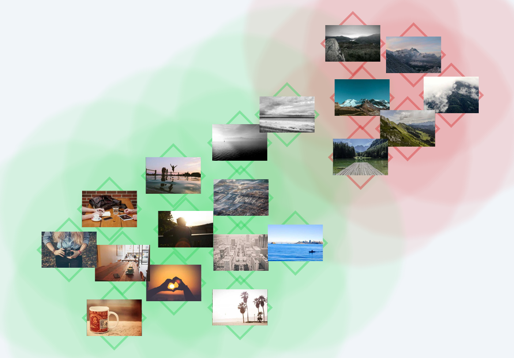
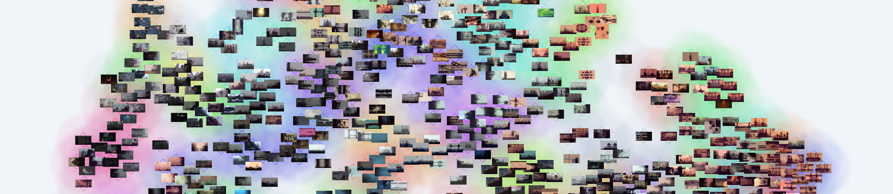

# Visual Image Similarity Explorer

This project is a Python-based toolset for analyzing and visualizing large collections of images.
The script processes a folder of images, first calculating their semantic embeddings using the CLIP ViT-B-32 model.
It then reduces these high-dimensional vectors into a 2D map using UMAP.
Thematic groups of images are identified through HDBSCAN clustering.
To improve the final layout, a physics-based relaxation algorithm is applied to prevent thumbnail overlap.
The tool is also built for efficiency by automatically finding and removing duplicate images based on file hashes.
It caches image embeddings to significantly speed up subsequent runs on the same dataset.
For fast browser loading, it generates optimized WebP texture atlases.
The final output is a self-contained HTML file that displays all images in a navigable atlas, with similar images placed closer to each other.

<div align="center">
    
</div>

## Installation

- Ensure you have Python 3.8 or newer installed.
- Clone this repository.
- Create and activate a Python virtual environment; the included `create-venv.bat` script can automate this on Windows.
- Install the required packages.
   - For systems with a compatible NVIDIA GPU, adjust the script for the PyTorch for your hardware and then run: `install-gpu.bat`
   - For CPU-only systems, run: `install-cpu.bat`

## Usage

The script operates on the concept of a "project directory".
This is a self-contained folder that holds everything related to the analysis of one image collection:
the source images, the generated data, and the final interactive HTML file.

- `images/` (or your chosen `<data_dir>`): This is where you must place your source images.

When you run the script, it will populate your chosen project directory with the following:

- `index.html`: The final, viewable atlas. Open this file in your browser to explore the results.
- `clusters.json`: The raw data file containing coordinates and metadata for each image.
- `embeddings.pkl`: A cache of the image embeddings to speed up future runs.
- `thumbs/`: A folder containing the generated WebP texture atlases for fast thumbnail loading.

To run the analysis, you use the main script `cluster.py` from the command line, pointing it to your project and data directories.

Command Structure: `python cluster.py <project_dir> <data_dir>`

- `<project_dir>`: The path to the project's main folder (e.g. `projects/demo`).
- `<data_dir>`: The name of the subfolder inside `<project_dir>` that contains your images (e.g. `images`).
- `--thumb_size <pixels>`: Sets the thumbnail resolution. Must be a divisor of 4096. Defaults to 128.
- `--force`: Forces recalculation of all image embeddings, ignoring the cache.

## Demo

A demo has been provided for you to experiment with.
Simply run `python cluster.py projects/demo images` and start a server in the `projects/demo` directory to view the clustered data.

<details>

<summary>
Click to see expected command line output.
</summary>

```
(venv) I:\projects\latent-atlas>python cluster.py projects\demo images
Project:     demo
Input:       I:\projects\latent-atlas\projects\demo\images
Thumb Size:  128px
Hardware:    CUDA

Scanning & Deduplicating files...
  Hashing 19 files...
  Total Unique: 19
  Duplicates:   0

  To Embed: 0

Dimensionality Reduction (UMAP)...
Clustering (HDBSCAN)...
Relaxing layout (Physics Simulation, 50 steps)...

Generating Texture Atlases (Parallel)...
  [Start] Atlas 1/1 (19 images)...
  [Done ] Atlas 1/1
Exporting data...
Visualization HTML (index.html) created in I:\projects\latent-atlas\projects\demo
Process complete. Output: I:\projects\latent-atlas\projects\demo\clusters.json
```

</details>

Enjoy an image of a larger distribution below.


